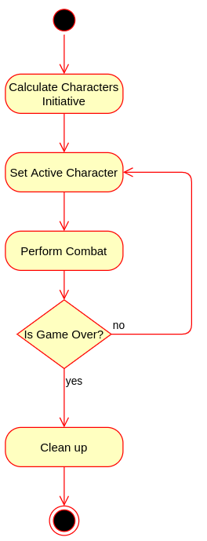

# Kogito D&D Battle Flow

This is the emulation of a battle in D&D. This first version is a **super** simplified battle system:

1. We only have one action: attack.
2. Our characters only fights with bare hands.
3. There are no armors as well.
4. Movement really doesn't matter.

The goal is to improve the combat in the future to at least emulate one of those old consoles JRPGs.

Here's the supported character's attributes:

- [Strength (STR):](https://roll20.net/compendium/dnd5e/Rules:Ability%20Scores/#h-Strength) How hard they are going to
  hit?
- [Dexterity (DEX):](https://roll20.net/compendium/dnd5e/Rules:Ability%20Scores/#toc_17) Used to calculate who attack
  first
- [Hit Points (HP):](https://roll20.net/compendium/dnd5e/Rules:Combat?expansion=0#h-Dropping%20to%200%20Hit%20Points)
  How hard you can get hit and move forward?
- [Armor:](https://roll20.net/compendium/dnd5e/Rules:Armor/#h-Armor) Although you are not wearing a real armor, your
  skin can be how thick?

These are the attributes that you need to fill for the characters to give them a chance to fight under the Kogito dome!

## The Battle Flow

This is how our workflow looks like:



1. The first thing is to decide who goes first based on each character dexterity, and their D20 roll.
2. Next, the workflow define the character's turn.
3. The active character attacks with their bare hands the enemy.
4. If both characters are still alive, another round is taken place.
5. Finally, after one of them is defeated the game is over.

The workflow was developed using the [Serverless Workflow DSL](https://serverlessworkflow.io/), and is running with the
Kogito Severless Workflow engine.

## Running locally with pre-built images

You can try the Kogito Battle Flow application by running the following commands in separated terminals:

```shell
docker-compose -f docker-compose.yaml  up -d
```

Then you can send a POST request to http://localhost:8080/battleflow with the following contents:

```json
{
  "workflowdata": {
    "player": {
      "name": "Sheldon Cooper",
      "armor": 5,
      "class": "Physicist",
      "dexterity": 2,
      "strength": 4,
      "hitPoints": 10
    },
    "enemy": {
      "name": "Gobbo",
      "armor": 5,
      "class": "Goblin",
      "dexterity": 2,
      "strength": 1,
      "hitPoints": 10
    }
  }
}
```

If you're interested in the produced events after each round, inspect the Sink logs with:

```shell
docker-compose logs -f
```

[Sheldon Cooper](https://bigbangtheory.fandom.com/wiki/Sheldon_Cooper) should be able to defeat a simple Goblin, right?
Wait for the response, and you shall see. Try playing around with the parameters to see the different battle outcomes.

For example, try having Sheldon fight against
an [Adult Black Dragon](https://roll20.net/compendium/dnd5e/Monsters:Adult%20Black%20Dragon/#toc_4) (STR 23, DEX 14, HP
195, Armor 19). :)

When you are done, run:

```shell
docker-compose down
```

Have fun!

## Building and testing locally

<details>
<summary>
Click here for more details
</summary>

This project uses Quarkus, the Supersonic Subatomic Java Framework.

If you want to learn more about Quarkus, please visit its website: https://quarkus.io/ .

## Running the application in dev mode

You can run your application in dev mode that enables live coding using:

```shell script
./mvnw compile quarkus:dev
```

> **_NOTE:_**  Quarkus now ships with a Dev UI, which is available in dev mode only at http://localhost:8080/q/dev/.

## Packaging and running the application

The application can be packaged using:

```shell script
./mvnw package
```

It produces the `quarkus-run.jar` file in the `target/quarkus-app/` directory. Be aware that it’s not an _über-jar_ as
the dependencies are copied into the `target/quarkus-app/lib/` directory.

If you want to build an _über-jar_, execute the following command:

```shell script
./mvnw package -Dquarkus.package.type=uber-jar
```

The application is now runnable using `java -jar target/quarkus-app/quarkus-run.jar`.

## Creating a native executable

You can create a native executable using:

```shell script
./mvnw package -Pnative
```

Or, if you don't have GraalVM installed, you can run the native executable build in a container using:

```shell script
./mvnw package -Pnative -Dquarkus.native.container-build=true
```

You can then execute your native executable with: `./target/battle-flow-1.0.0-SNAPSHOT-runner`

If you want to learn more about building native executables, please consult https://quarkus.io/guides/maven-tooling.html
.
</details>

## References

- [D&D 5th Edition Compendium](https://roll20.net/compendium/dnd5e/Rules:Combat#content)